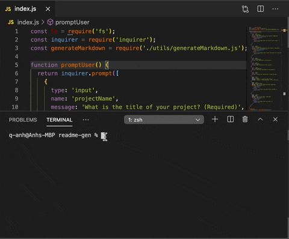

# README.md Generator with node.js

### Description 
An application that takes in user's input and generate a readme.md using node.js

### Installation 
1. Use `npm i inquirer` in order to use the application
2. Run `node index` in terminal and answer all the questions

### Usage and demo

